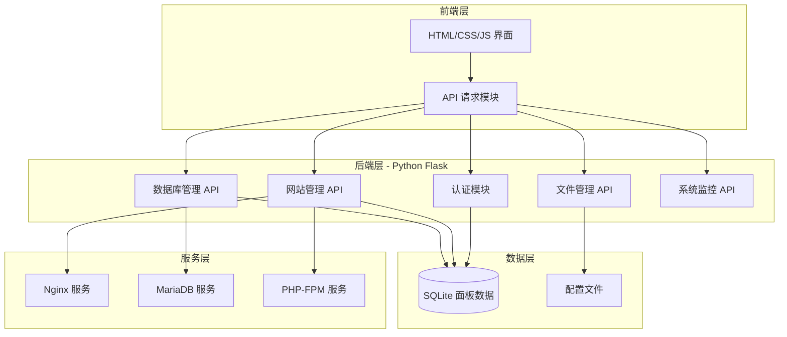
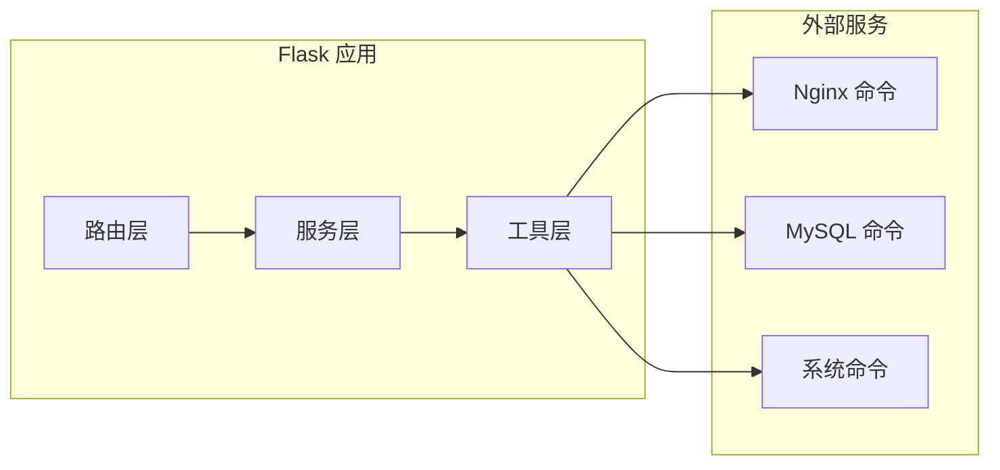
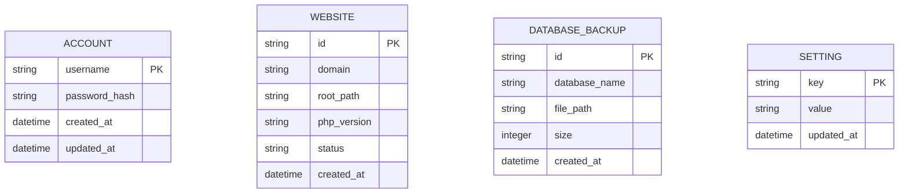

# ZeroPanel v2.0 技术架构文档

## 1. 架构设计



## 2. 技术说明

- **前端**: 原生 HTML5 + CSS3 + JavaScript (ES6+)
- **后端**: Python 3.x + Flask
- **数据库**: SQLite (面板配置) + MariaDB (网站数据库)
- **Web 服务器**: Nginx
- **PHP 处理**: PHP-FPM
- **运行环境**: ZeroTermux (Android)

## 3. 路由定义

| 路由 | 用途 |
|------|------|
| `/` | 登录页面 |
| `/dashboard` | 仪表盘主页 |
| `/websites` | 网站管理 |
| `/databases` | 数据库管理 |
| `/files` | 文件管理 |
| `/monitor` | 系统监控 |
| `/settings` | 账号设置 |

## 4. API 定义

### 4.1 认证 API

```typescript
// POST /api/login
interface LoginRequest {
  username: string;
  password: string;
  remember: boolean;
}

interface LoginResponse {
  success: boolean;
  message: string;
  token?: string;
}

// POST /api/logout
interface LogoutResponse {
  success: boolean;
}

// GET /api/check-auth
interface AuthCheckResponse {
  authenticated: boolean;
  user?: { username: string };
}
```

### 4.2 网站管理 API

```typescript
// GET /api/websites
interface Website {
  id: string;
  domain: string;
  root: string;
  status: 'running' | 'stopped';
  php_version: string;
  created_at: string;
}

interface WebsiteListResponse {
  websites: Website[];
}

// POST /api/websites
interface CreateWebsiteRequest {
  domain: string;
  root: string;
  php_version: string;
}

// DELETE /api/websites/:id
// POST /api/websites/:id/start
// POST /api/websites/:id/stop
// POST /api/websites/:id/restart
```

### 4.3 数据库管理 API

```typescript
// GET /api/databases
interface Database {
  name: string;
  charset: string;
  size: string;
  tables: number;
}

// POST /api/databases
interface CreateDatabaseRequest {
  name: string;
  charset: string;
  user?: string;
  password?: string;
}

// DELETE /api/databases/:name
// GET /api/databases/:name/backup
// POST /api/databases/:name/restore
```

### 4.4 文件管理 API

```typescript
// GET /api/files?path=xxx
interface FileItem {
  name: string;
  type: 'file' | 'directory';
  size: number;
  modified: string;
  permissions: string;
}

// POST /api/files/upload
// POST /api/files/download
// POST /api/files/mkdir
// POST /api/files/rename
// DELETE /api/files
```

### 4.5 系统监控 API

```typescript
// GET /api/system/info
interface SystemInfo {
  hostname: string;
  os: string;
  kernel: string;
  uptime: string;
  cpu_model: string;
  cpu_cores: number;
  total_memory: number;
  total_disk: number;
}

// GET /api/system/stats
interface SystemStats {
  cpu_usage: number;
  memory_usage: number;
  memory_used: number;
  disk_usage: number;
  disk_used: number;
  network_in: number;
  network_out: number;
  load_avg: number[];
}
```

### 4.6 账号设置 API

```typescript
// POST /api/account/password
interface ChangePasswordRequest {
  old_password: string;
  new_password: string;
  confirm_password: string;
}
```

## 5. 服务架构图



## 6. 数据模型

### 6.1 数据模型定义



### 6.2 数据定义语言

```sql
-- 账号表
CREATE TABLE IF NOT EXISTS account (
    username TEXT PRIMARY KEY,
    password_hash TEXT NOT NULL,
    created_at TIMESTAMP DEFAULT CURRENT_TIMESTAMP,
    updated_at TIMESTAMP DEFAULT CURRENT_TIMESTAMP
);

-- 网站表
CREATE TABLE IF NOT EXISTS websites (
    id TEXT PRIMARY KEY,
    domain TEXT UNIQUE NOT NULL,
    root_path TEXT NOT NULL,
    php_version TEXT DEFAULT '8.0',
    status TEXT DEFAULT 'stopped',
    created_at TIMESTAMP DEFAULT CURRENT_TIMESTAMP
);

-- 数据库备份表
CREATE TABLE IF NOT EXISTS database_backups (
    id TEXT PRIMARY KEY,
    database_name TEXT NOT NULL,
    file_path TEXT NOT NULL,
    size INTEGER DEFAULT 0,
    created_at TIMESTAMP DEFAULT CURRENT_TIMESTAMP
);

-- 设置表
CREATE TABLE IF NOT EXISTS settings (
    key TEXT PRIMARY KEY,
    value TEXT,
    updated_at TIMESTAMP DEFAULT CURRENT_TIMESTAMP
);

-- 初始管理员账号 (密码: admin123)
INSERT OR IGNORE INTO account (username, password_hash)
VALUES ('admin', 'pbkdf2:sha256:260000$...');
```

## 7. 项目结构

```
zeropanel/
├── app.py                 # Flask 主应用
├── install.sh             # 一键安装脚本
├── requirements.txt       # Python 依赖
├── data/                  # 数据目录
│   ├── panel.db          # SQLite 数据库
│   ├── backups/           # 数据库备份
│   └── uploads/           # 上传文件
├── static/                # 静态资源
│   ├── css/
│   │   └── style.css
│   ├── js/
│   │   ├── app.js
│   │   ├── dashboard.js
│   │   ├── websites.js
│   │   ├── databases.js
│   │   ├── files.js
│   │   └── monitor.js
│   └── img/
│       └── logo.svg
└── templates/             # HTML 模板
    ├── login.html
    ├── dashboard.html
    ├── websites.html
    ├── databases.html
    ├── files.html
    ├── monitor.html
    └── settings.html
```

## 8. 安全考虑

1. **认证安全**: 密码使用 pbkdf2 加密存储，Session 有效期控制
2. **输入验证**: 所有用户输入进行严格验证和转义
3. **SQL 注入防护**: 使用参数化查询
4. **路径遍历防护**: 文件操作限制在允许目录内
5. **命令注入防护**: 系统命令使用安全方式执行
