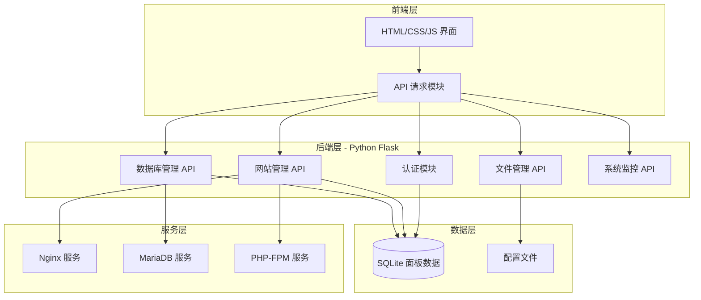

# ZeroPanel v2.0

一款为 ZeroTermux 设计的轻量级建站面板，支持网站管理、数据库管理、文件管理、系统监控和云更新。

---

## 目录

1. [安装教程](#安装教程)
2. [快速上手](#快速上手)
3. [常用命令](#常用命令)
4. [技术架构](#技术架构)
5. [API 定义](#api-定义)
6. [项目结构](#项目结构)
7. [安全考虑](#安全考虑)
8. [开发指南](#开发指南)

---

## 安装教程

### 环境要求

- Android 设备，已安装 [ZeroTermux](https://github.com/1q23lyc45/ZeroTermux/releases)
- 至少 200MB 可用存储空间
- 建议 Android 8.0 及以上版本

---

### 方式一：一键在线安装（推荐）

在 ZeroTermux 终端中执行：

```bash
bash <(curl -fsSL https://raw.githubusercontent.com/2136206076/ZeroPanel/main/zeropanel/install.sh)
```

安装过程会自动完成：

1. 更新 Termux 软件源
2. 安装 Python 3、Nginx、MariaDB、PHP-FPM
3. 安装 Python 依赖（Flask、Flask-CORS、Werkzeug）
4. 创建 `zeropanel` 快捷命令
5. 启动面板服务

安装完成后，访问：

```text
http://localhost:5000
```

默认登录账号：

| 字段 | 值 |
|------|-----|
| 账号 | `admin` |
| 密码 | `admin123` |

> 登录后请立即进入「账号设置」修改默认密码。

---

### 方式二：手动安装

适合想自定义安装路径或排查问题的用户。

#### 步骤 1：安装基础依赖

```bash
pkg update -y
pkg install -y python3 nginx mariadb php-fpm curl unzip
```

#### 步骤 2：安装 Python 依赖

```bash
pip3 install -r requirements.txt
```

#### 步骤 3：下载并解压面板

```bash
cd ~
curl -fsSL -O https://raw.githubusercontent.com/2136206076/ZeroPanel/main/zeropanel_v2.zip
unzip zeropanel_v2.zip -d ~/zeropanel
```

#### 步骤 4：运行本地安装脚本

```bash
bash ~/zeropanel/install.sh
```

#### 步骤 5：启动面板

```bash
zeropanel start
```

然后访问 `http://localhost:5000` 登录。

---

## 快速上手

### 首次使用配置

1. **修改默认密码**：登录后进入「账号设置」→「修改密码」
2. **创建第一个网站**：进入「网站管理」→「创建网站」，输入域名和端口
3. **创建数据库**：进入「数据库」→「创建数据库」
4. **上传网站文件**：进入「文件管理」，上传到网站根目录

---

## 常用命令

安装完成后，可以使用 `zeropanel` 命令管理面板：

```bash
zeropanel start      # 启动面板
zeropanel stop       # 停止面板
zeropanel restart    # 重启面板
zeropanel status     # 查看面板及 Nginx/MariaDB/PHP-FPM 状态
zeropanel log        # 查看面板运行日志
```

---

## 常见问题

### 1. 安装过程中提示 `curl: command not found`

执行 `pkg install -y curl` 后重新运行安装命令。

### 2. 安装后访问 `http://localhost:5000` 无响应

检查面板服务是否运行：

```bash
zeropanel status
```

如果没有运行，尝试启动：

```bash
zeropanel start
```

查看日志：

```bash
zeropanel log
```

### 3. 创建网站后无法访问

确保网站状态为「运行中」，并且端口没有被其他应用占用。可以在 ZeroTermux 中执行：

```bash
ss -tlnp | grep 你的端口
```

### 4. 如何卸载 ZeroPanel

```bash
zeropanel stop
rm -rf ~/zeropanel
rm -f $PREFIX/bin/zeropanel
```

> 注意：卸载会删除所有网站数据和数据库，请提前备份 `~/zeropanel/data/`。

---

## 技术架构

### 1. 架构设计



### 2. 技术说明

- **前端**: 原生 HTML5 + CSS3 + JavaScript (ES6+)
- **后端**: Python 3.x + Flask
- **数据库**: SQLite (面板配置) + MariaDB (网站数据库)
- **Web 服务器**: Nginx
- **PHP 处理**: PHP-FPM
- **运行环境**: ZeroTermux (Android)

---

## API 定义

### 路由定义

| 路由 | 用途 |
|------|------|
| `/` | 登录页面 |
| `/dashboard` | 仪表盘主页 |
| `/websites` | 网站管理 |
| `/databases` | 数据库管理 |
| `/files` | 文件管理 |
| `/monitor` | 系统监控 |
| `/settings` | 账号设置 |

### 认证 API

```typescript
// POST /api/login
interface LoginRequest {
  username: string;
  password: string;
  remember: boolean;
}

interface LoginResponse {
  success: boolean;
  message: string;
  token?: string;
}

// POST /api/logout
interface LogoutResponse {
  success: boolean;
}

// GET /api/check-auth
interface AuthCheckResponse {
  authenticated: boolean;
  user?: { username: string };
}
```

### 网站管理 API

```typescript
// GET /api/websites
interface Website {
  id: string;
  domain: string;
  root: string;
  status: 'running' | 'stopped';
  php_version: string;
  created_at: string;
}

interface WebsiteListResponse {
  websites: Website[];
}

// POST /api/websites
interface CreateWebsiteRequest {
  domain: string;
  root: string;
  php_version: string;
}

// DELETE /api/websites/:id
// POST /api/websites/:id/start
// POST /api/websites/:id/stop
// POST /api/websites/:id/restart
```

### 数据库管理 API

```typescript
// GET /api/databases
interface Database {
  name: string;
  charset: string;
  size: string;
  tables: number;
}

// POST /api/databases
interface CreateDatabaseRequest {
  name: string;
  charset: string;
  user?: string;
  password?: string;
}

// DELETE /api/databases/:name
// GET /api/databases/:name/backup
// POST /api/databases/:name/restore
```

### 文件管理 API

```typescript
// GET /api/files?path=xxx
interface FileItem {
  name: string;
  type: 'file' | 'directory';
  size: number;
  modified: string;
  permissions: string;
}

// POST /api/files/upload
// POST /api/files/download
// POST /api/files/mkdir
// POST /api/files/rename
// DELETE /api/files
```

### 系统监控 API

```typescript
// GET /api/system/info
interface SystemInfo {
  hostname: string;
  os: string;
  kernel: string;
  uptime: string;
  cpu_model: string;
  cpu_cores: number;
  total_memory: number;
  total_disk: number;
}

// GET /api/system/stats
interface SystemStats {
  cpu_usage: number;
  memory_usage: number;
  memory_used: number;
  disk_usage: number;
  disk_used: number;
  network_in: number;
  network_out: number;
  load_avg: number[];
}
```

### 账号设置 API

```typescript
// POST /api/account/password
interface ChangePasswordRequest {
  old_password: string;
  new_password: string;
  confirm_password: string;
}
```

---

## 项目结构

```
ZeroPanel/
├── README.md              # 项目文档
├── CHANGELOG.md           # 更新日志
├── VERSION                # 版本号
├── .gitignore             # Git 忽略规则
└── zeropanel/             # 面板主程序
    ├── app.py             # Flask 主应用
    ├── install.sh         # 一键安装脚本
    ├── requirements.txt   # Python 依赖
    ├── test_verify.py     # 功能验证测试脚本
    ├── data/              # 运行时数据（自动生成，不入库）
    │   ├── panel.db       # SQLite 数据库
    │   ├── .secret_key    # 会话密钥
    │   ├── backups/       # 数据库备份
    │   └── uploads/       # 上传文件
    ├── static/            # 静态资源
    │   ├── css/
    │   │   └── style.css
    │   ├── js/
    │   │   ├── app.js
    │   │   ├── dashboard.js
    │   │   ├── websites.js
    │   │   ├── databases.js
    │   │   ├── files.js
    │   │   ├── monitor.js
    │   │   └── settings.js
    │   └── img/
    │       └── logo.svg
    └── templates/         # HTML 模板
        ├── login.html
        ├── dashboard.html
        ├── websites.html
        ├── databases.html
        ├── files.html
        ├── monitor.html
        └── settings.html
```

---

## 安全考虑

1. **认证安全**: 密码使用 pbkdf2 加密存储，Session 有效期控制
2. **输入验证**: 所有用户输入进行严格验证和转义
3. **SQL 注入防护**: 使用参数化查询
4. **路径遍历防护**: 文件操作限制在允许目录内
5. **命令注入防护**: 系统命令使用安全方式执行

---

## 开发指南

### 本地运行测试

```bash
cd zeropanel
pip3 install -r requirements.txt
python3 test_verify.py
```

### 发布新版本

```bash
python3 build.py patch   # 或 minor / major
```

`build.py` 会自动：

1. 更新 `VERSION` 文件
2. 同步 `app.py` 中的 `PANEL_VERSION`
3. 追加更新日志到 `CHANGELOG.md`
4. 重新打包 `zeropanel_v2.zip`

然后提交并推送：

```bash
git add -A
git commit -m "release: v$(cat VERSION)"
git push origin main
```

---

## 许可证

MIT License
